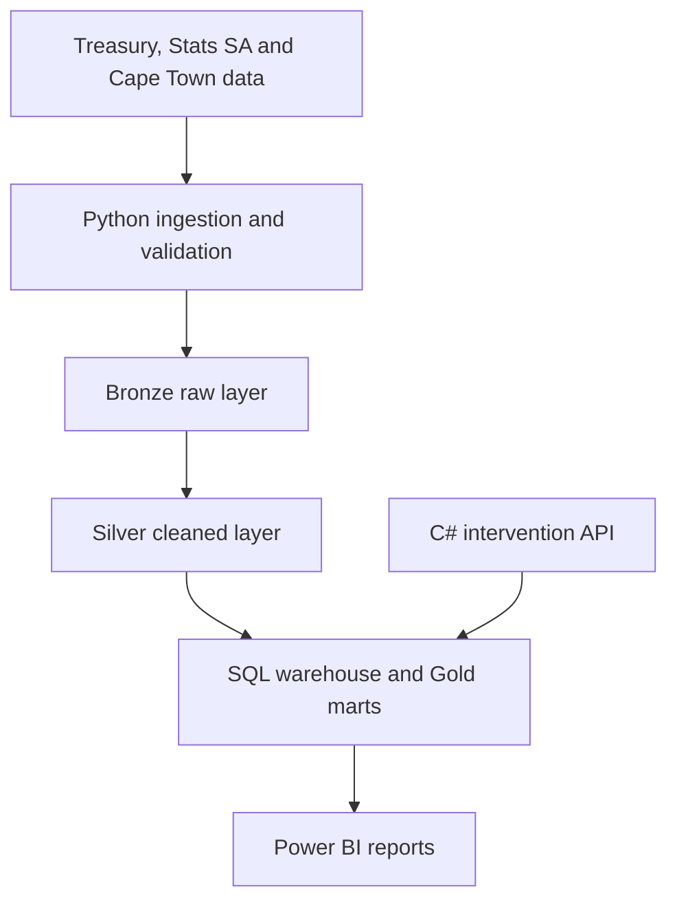

# Municipal Service Delivery and Infrastructure Performance Analytics

An enterprise-style data analysis and business intelligence project examining municipal service access, operational performance, financial alignment and intervention outcomes in South Africa, with the City of Cape Town as the detailed case study.

## Current status

**Phase 2 — data validation and repository foundation**

- Project charter completed
- Public sources and publication frequencies validated
- Reproducible ingestion foundation created
- Data quality and source registers created
- Raw datasets intentionally excluded from Git
- Power BI, warehouse and intervention application planned for later releases

## Business objective

Connect household service access, municipal finance, geographic context and operational interventions so that decision-makers can answer:

1. Where are service gaps concentrated?
2. Which services and areas experience repeated problems?
3. Which factors are associated with slower resolution?
4. Is spending aligned with service need and outcomes?
5. Which groups experience the greatest disadvantage?
6. Do completed interventions improve the selected KPIs?

The project distinguishes observed facts, statistical associations, likely contributing factors and untested hypotheses. It does not treat correlation as proof of causation.

## Planned architecture



## Repository structure

| Path | Purpose |
|---|---|
| `config/` | Versioned, non-secret source configuration |
| `data/` | Local Bronze, Silver, Gold and quarantine data; contents ignored by Git |
| `docs/` | Charter, source register, quality assessment and decisions |
| `src/ingestion/` | Reproducible public-data ingestion code |
| `src/analysis/` | Exploratory and root-cause analysis code |
| `src/sql/` | Staging, warehouse and validation SQL |
| `src/powerbi/` | Power BI documentation and measures |
| `src/api/` | Future ASP.NET Core intervention service |
| `tests/` | Automated Python tests |
| `.github/workflows/` | Continuous integration |

## Data freshness

| Source | Refresh classification |
|---|---|
| National Treasury Municipal Money | Scheduled quarterly publication |
| Stats SA General Household Survey | Annual publication |
| City of Cape Town Open Data | Dataset-dependent scheduled refresh |
| C# Intervention Tracker | Immediate operational updates |

## Quick start

Requirements: Python 3.11+ and Git.

```bash
python -m venv .venv
```

Windows PowerShell:

```powershell
.venv\Scripts\Activate.ps1
python -m pip install -e ".[dev]"
python -m pytest
python -m ingestion.validate_sources --config config/sources.json
```

Linux/macOS:

```bash
source .venv/bin/activate
python -m pip install -e '.[dev]'
python -m pytest
python -m ingestion.validate_sources --config config/sources.json
```

The validator writes a machine-readable run manifest to `data/metadata/`. It does not download large survey or GIS files yet. Dataset-specific downloads will be enabled only after exact resource URLs and terms have been recorded.

## GitHub data policy

- Do not commit raw, personal, restricted or large data files.
- Do not commit credentials, tokens or `.env` files.
- Commit scripts, schemas, small synthetic fixtures and documentation.
- Record the source URL, retrieval time, checksum and licence/terms for every downloaded dataset.
- Use Git LFS only for an approved small portfolio asset such as the final `.pbix`, if needed.

## Source documentation

- [Data-source register](docs/data_source_register.md)
- [Phase 2 validation report](docs/phase_2_data_validation.md)
- [Project charter](docs/project_charter.md)

## Roadmap

- [x] Phase 1: charter and analytical scope
- [x] Phase 2A: source validation and GitHub-ready repository
- [ ] Phase 2B: sample ingestion and automated profiling
- [ ] Phase 3: exploratory and root-cause analysis
- [ ] Phase 4: SQL warehouse and Power BI report
- [ ] Phase 5: C# intervention application
- [ ] Phase 6: Docker, CI/CD, cloud demonstration and handover

## Licence

Project source code is licensed under the MIT License. Third-party datasets remain subject to their providers' terms and are not redistributed by this repository.
